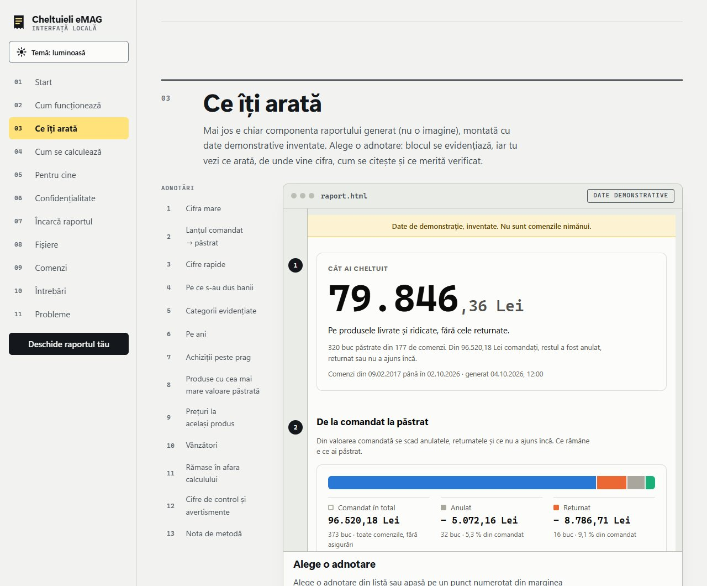

# Cheltuieli eMAG

[](LICENSE)
[](https://github.com/poprobert0412/cheltuieli-emag/actions/workflows/teste.yml)

Program pentru Windows care citește comenzile și retururile din propriul tău cont eMAG și îți arată cât ai cheltuit efectiv, pe ce și în ce ani. Rulează pe calculatorul tău: nimic nu se trimite nicăieri.

> [!WARNING]
> **Citește înainte să rulezi.**
> - Proiect independent, **neafiliat cu eMAG**. Accesul automat la un cont poate fi contrar termenilor eMAG: îl folosești pe răspunderea ta, doar pe contul tău și cu moderație.
> - Partea cu browserul (login și citirea paginilor eMAG) a fost testată cu pagini inventate și a rulat cap-la-cap pe **un singur cont real** (al autorului, cam 400 de comenzi), dar **nu a fost încă validată pe mai multe conturi**. eMAG își poate schimba paginile oricând, iar atunci programul poate da erori sau cifre greșite: **compară totalurile cu pagina „Comenzile mele” de pe eMAG.**

## Ce face și ce primești

Programul deschide o fereastră de browser, te loghezi tu în eMAG, iar el citește istoricul de comenzi și de retururi (paginile pe care le vezi și tu). Apoi calculează și scrie:

- **cât ai cheltuit efectiv**: doar produsele livrate sau ridicate, fără cele anulate sau returnate; ce n-a ajuns încă apare separat;
- **pe ce s-au dus banii**: pe categorii (reguli pe care le poți edita), pe ani, pe vânzători, plus cele mai valoroase produse păstrate;
- **achiziții mari**: produsele cu preț pe bucată peste un prag (implicit 500 Lei, îl poți schimba);
- **prețuri la același produs**: dacă ai cumpărat același model de mai multe ori, vezi cum s-a schimbat prețul („mai scump” sau „mai ieftin” cu X Lei). Culorile se ignoră („alb” și „negru” sunt același produs), capacitatea sau dimensiunea nu (128GB și 256GB sunt produse diferite). Prețul include promoții și e dinainte de vouchere, iar vânzătorii pot fi diferiți: diferența arată o schimbare de preț, nu o pierdere sau un câștig;
- **avertismente cu detalii**: grupe care se deschid, cu explicația, efectul asupra cifrelor și linkuri către comenzile de pe eMAG, ca să verifici repede ce nu s-a legat.

Fișierele (într-un folder nou la fiecare rulare, în `iesiri/`): `raport.html` (un singur fișier, se deschide fără internet), `produse.csv` și `istoric_preturi.csv` (pentru Excel), `rezumat.txt` (cifrele principale, în text) și `analiza.json` (rezultatul complet, din care se desenează raportul).

## Cum arată

Raportul demonstrativ, cu date **inventate** (nu sunt comenzile nimănui):

<picture>
  <source media="(prefers-color-scheme: dark)" srcset="docs/img/raport-intunecat.jpg">
  
</picture>

Raportul are temă luminoasă și întunecată, urmând setarea sistemului tău.

## Pornire rapidă (Windows)

1. **Descarcă și extrage.** Pe pagina depozitului: **Code → Download ZIP**. Apoi clic dreapta pe fișierul descărcat → **Extract All** (Extrage tot), într-un folder simplu, de exemplu `C:\cheltuieli-emag`. Nu rula nimic direct din ZIP și nu pune folderul în OneDrive.
2. **Dublu-click pe `porneste.bat`.** Instalează singur ce lipsește (1–3 minute, are nevoie de internet), apoi pornește aplicația locală și deschide pagina ei în browser. Un singur lucru îl faci tu, o dată: să ai **Python 3.10 sau mai nou** de pe [python.org](https://www.python.org/downloads/), cu căsuța **„Add python.exe to PATH”** bifată; dacă lipsește, `porneste.bat` îți spune ce să faci.
3. **În pagina care se deschide, apasă „Pornește analiza”.** Se deschide o fereastră Edge: te loghezi **tu** în eMAG (parola și codul 2FA le scrii tu). Apoi programul citește comenzile și retururile și arată raportul în aceeași pagină. Durează de obicei câteva minute (aproximativ 2–3 minute pentru ~400 de comenzi, măsurat o singură dată pe un cont real; depinde de conexiune).

Nu ai încă încredere sau vrei doar să vezi cum arată? Apasă **„Încearcă cu date inventate”** în aceeași pagină (fără login, fără cont) sau dă dublu-click pe `demo.bat`.

Pași detaliați, ce vezi pe ecran la fiecare pas, rezolvări pentru avertismentele Windows (SmartScreen, antivirus), actualizare și dezinstalare: **[docs/INSTALARE.md](docs/INSTALARE.md)**.

> [!NOTE]
> Pentru cine preferă pașii separați există și lansatoarele: `instaleaza.bat` (instalarea), `login.bat` (doar te loghezi), `ruleaza.bat` (calculul, cu raportul deschis la final), `demo.bat` (date inventate), `sterge_sesiunea.bat` (ștergi sesiunea eMAG salvată) și `deschide_interfata.bat` (site-ul explicativ). Sunt descrise în [docs/INSTALARE.md](docs/INSTALARE.md).

## Cum se calculează

- **Comandat** = valoarea tuturor produselor din comenzi (fără asigurările plătite fără livrare), la prețul din pagina comenzii.
- **Anulat** = produse din blocuri „Livrare anulată” fără retur finalizat.
- **Returnat** = retururi cu pasul „Restituire sumă”. Retururile vechi de la vânzători din marketplace apar în eMAG ca „Livrare anulată”; dacă există retur finalizat, se numără ca returnat, nu ca anulare.
- **În curs** = produse al căror bloc arată un status de dinainte de livrare (plasată, predată curierului, în drum…). Programul nu verifică plata.
- **Păstrat** = comandat − anulat − returnat − în curs. Asta e „cât ai cheltuit pe produse”.
- **Prețurile** sunt cele afișate de eMAG înainte de vouchere; voucherele, transportul și taxele sunt în „Cifre de control” din raport. Un status pe care programul nu-l recunoaște nu e numărat niciodată ca livrat: apare ca avertisment.

## Interfața

Sunt două pagini, ambele în folderul `interfata/`:

**Aplicația locală (`aplicatie.html`)** e calea obișnuită: o pornești cu dublu-click pe `porneste.bat` (sau, din terminal, cu `python ruleaza.py --aplicatie`). Butonul **„Pornește analiza”** face tot: deschide fereastra de login, citește comenzile și retururile, calculează și arată raportul în aceeași pagină, cu progres pe pași. Lista **„Rulări anterioare”** (din `iesiri/`) înlocuiește tragerea de fișiere, iar **„Încearcă cu date inventate”** rulează demonstrația fără login. Pagina vorbește doar cu un server pornit local de program, pe `127.0.0.1` (vezi [SECURITY.md](SECURITY.md)); când închizi aplicația, serverul se oprește.

**Site-ul explicativ (`index.html`)** se deschide cu dublu-click pe `deschide_interfata.bat` (sau direct în browser, din folder), fără server. Explică ce face programul, ce citește și ce nu, cum se calculează fiecare cifră și arată un raport demonstrativ cu date inventate. Poate vedea și un `analiza.json` din `iesiri\<data>_<ora>\`: fișierul se citește local, în browser, și nu se trimite nicăieri. Pagina nu face cereri de rețea (o politică de conținut din `index.html` le blochează în browser) și nu poate porni programul; numerele de comandă sunt linkuri către eMAG care se deschid doar când apeși pe ele, în browserul tău.

Fișierele: `aplicatie.html` și `index.html` cu `assets/` (stiluri și scripturi), `assets/dashboard.css` și `assets/dashboard.js` (componenta raportului, aceeași sursă ca raportul generat) și `assets/demo-data.js` (date inventate, regenerate cu `ruleaza.py --demo`).

## Siguranță și confidențialitate

**Pe scurt:** nimic nu pleacă de pe calculatorul tău. Fără telemetrie, fără server al autorului, fără cont, fără trimiterea rapoartelor. Programul nu cere și nu tastează parola.

**Ce face în rețea.** Programul cere pagini doar de pe `www.emag.ro`, prin browserul pe care îl controlează, cu sesiunea ta. Fereastra Edge încarcă paginile eMAG exact ca atunci când intri tu, deci contactează și serviciile lor și pe cele ale Edge (autentificare, statistici); programul nu controlează acele cereri. În plus, aplicația locală ascultă pe `127.0.0.1` (doar acest calculator, nu rețeaua), protejată cu o cheie secretă generată la fiecare pornire.

**Ce apare pe disc.** În folderul programului: `iesiri/` (rapoartele), `logs/` (jurnalul) și `.profil_browser/` (sesiunea eMAG), toate ștergibile. Programul nu scrie în Registry, în AppData sau în folderul tău personal. Nuanță măsurată pe o instalare de test: Edge, pornit de program, își scrie singur în `%TEMP%` două fișiere `.tmp` (șterse la închidere) și `cv_debug.log` (rămâne). Instalarea pachetelor scrie doar în `.venv/`, în folderul programului.

| Loc | Ce conține | Date personale? |
|---|---|---|
| `.profil_browser/` | sesiunea ta eMAG (cookie-uri), istoricul și memoria cache ale ferestrei Edge a programului | **Da, cel mai sensibil**: tratează-l ca pe o parolă |
| `iesiri/<rulare>/` | comenzile și retururile citite, raportul, CSV-urile, rezumatul | Da: istoricul tău de cumpărături |
| `logs/` | jurnalul sesiunii: progres și erori | Puține: căile pot conține numele contului Windows, iar erorile pot cita numere de comandă |

**Ce garantează testele-gardă și verificările automate** (doar ce există în `tests/test_garda_*.py` și `.github/workflows/`):

- `tests/test_garda_parole.py`: în cod nu există tastare în pagini (`fill`, `type`, `press`…), citirea cookie-urilor sau ascultarea cererilor browserului; programul citește doar variabilele de mediu `EMAG_*` dintr-o listă fixă; niciun fișier de urcat în depozit nu conține chei, token-uri, IBAN sau CNP valide, numere de telefon, adrese de e-mail sau numele contului Windows al celui care rulează testul; `.gitignore` acoperă sesiunea, rezultatele și jurnalele.
- `tests/test_garda_retea.py`: codul Python nu importă module de rețea sau de pornire a altor programe, cu o singură excepție: `app_server.py` (serverul local) poate asculta, doar pe `127.0.0.1`, pe un port ales de sistem, fără conexiuni ieșite; adresele din cod au gazda `emag.ro`; interfața nu conține cereri de rețea, resurse externe sau formulare, cu o singură excepție: aplicația locală vorbește cu serverul local prin `fetch()` spre `/api/…`, dintr-un singur fișier (`app-api.js`); fluxurile `--demo`, `--din-cache` și `--sterge-sesiunea` rulează cu rețeaua blocată și notată.
- `tests/test_garda_scriere.py`: în cod nu există `Path.home`, `tempfile`, `winreg`; fluxurile de mai sus, plus aplicația locală (o rulare demo, ștergerea sesiunii și oprirea, prin serverul real), rulează cu un hook care notează și oprește orice scriere în afara folderelor permise.
- `tests/test_app_*.py`: serverul local, pe cereri HTTP reale: cheie lipsă sau greșită, `Host` sau `Origin` străine, tip de conținut greșit, corp prea mare, lipsa antetelor CORS, lista albă de fișiere (`..`, nume Windows speciale, foldere), legarea doar la `127.0.0.1`, oprirea și jurnalul fără cheie.
- `.github/workflows/`: aceleași teste la fiecare push și pull request (`teste.yml`, Windows, Python 3.13 și 3.14); gitleaks pe tot istoricul și pe arborele curent, plus o verificare că git nu urmărește fișiere cu date personale (`secrete.yml`); `pip-audit` pe dependențele fixate (`siguranta.yml`); CodeQL pe Python și JavaScript (`codeql.yml`); Dependabot propune săptămânal actualizări.

**Ce NU garantează.** Testele-gardă caută tipare în cod; nu dovedesc că nu există alt mod de a ocoli ce caută. Nu verifică ce primește eMAG, ce face Edge pe cont propriu (cereri, fișiere în `%TEMP%`) și nici codul dependențelor (Playwright ș.a.). Fluxul cu login real nu rulează în teste. Serverul local al aplicației a fost verificat cu testele din depozit și cu probe ale autorului, nu printr-un audit de securitate independent. Fișierele din `.github/` au fost verificate local ca sintaxă (`actionlint`), dar **nu s-au putut verifica local rularea lor efectivă pe GitHub, CodeQL, Dependabot și Edge pe `windows-latest`**; insigna „Teste” de sus apare abia după prima rulare. Un ZIP descărcat din altă parte decât acest depozit nu e acoperit de nimic din toate astea.

> [!CAUTION]
> - **Nu pune `iesiri/`, `.profil_browser/` sau `logs/` pe GitHub**, în cloud (OneDrive, Google Drive) sau în e-mail.
> - **Nu atașa în Issues** `comenzi.json`, `retururi.json`, `analiza.json`, `iesiri/`, `logs/` sau capturi cu nume, adresă sau comenzi reale.
> - **Atenție la partajarea ecranului**: raportul și linkurile către comenzi arată ce ai cumpărat.
> - Descarcă programul doar din acest depozit și nu-l rula ca Administrator.

Detalii, raportarea unei vulnerabilități și ștergerea urmelor: **[SECURITY.md](SECURITY.md)**.

## Limitări oneste

- **Nevalidat cap-la-cap pe mai multe conturi reale** (vezi avertismentul de sus): după o schimbare a paginilor eMAG pot apărea erori sau cifre greșite. Parserul avertizează când sumele nu se leagă, dar nimic nu garantează că prinde orice schimbare.
- **Testat pe Windows 11, Python 3.13 și 3.14, cu Edge.** Python 3.10 și mai nou ar trebui să meargă, dar nu a fost încercat. Pe Mac și Linux codul e portabil, însă lansatoarele `.bat` sunt doar pentru Windows și nimic nu a fost testat acolo (setează `EMAG_BROWSER_CHANNEL=chrome`).
- **Doar eMAG România** (`emag.ro`): `emag.bg` și `emag.hu` nu sunt acoperite.
- **Nu ține locul extrasului bancar.** Prețurile sunt cele afișate de eMAG înainte de vouchere, iar plățile reale pot diferi.
- **Cere paginile câte 3 odată**, fără pauze între ele (pauză doar după o eroare). eMAG poate limita accesul automat.
- **Verificările automate de pe GitHub nu au rulat încă acolo** (vezi mai sus).

## Întrebări frecvente

<details>
<summary><strong>De ce e nevoie de login?</strong></summary>

Istoricul de comenzi se vede doar după autentificare. Programul citește aceleași pagini pe care le vezi tu, în contul tău. Te loghezi tu, în fereastra Edge: parola și codul 2FA nu trec prin program, iar el nu le tastează și nu le salvează. Sesiunea rămâne în `.profil_browser/`, ca la rulările următoare să nu mai fie nevoie de login cât timp eMAG nu o expiră.
</details>

<details>
<summary><strong>E permis de eMAG?</strong></summary>

Nu știm. Proiectul nu are legătură cu eMAG, iar accesul automat poate fi contrar termenilor lor. Îl folosești pe răspunderea ta, doar pe contul tău. Programul cere paginile câte 3 odată, fără pauze între ele, deci nu rula analiza de zeci de ori pe zi. eMAG poate oricând să limiteze accesul automat sau să blocheze contul.
</details>

<details>
<summary><strong>De ce cifrele diferă de ce văd pe eMAG?</strong></summary>

Prețurile sunt cele de pe pagina comenzii, înainte de vouchere; transportul și taxele sunt separate („Cifre de control”). Anulatele, returnatele și ce n-a ajuns încă se scad din „păstrat”. Plățile reale (card, ramburs, vouchere) pot da alt total. Dacă o diferență nu se explică așa, deschide comanda din link și compară-o cu raportul; dacă pare o greșeală a programului, deschide un Issue (fără date personale).
</details>

<details>
<summary><strong>Cum actualizez?</strong></summary>

Descarcă ZIP-ul nou într-un folder nou și extrage-l. Din folderul vechi copiezi doar ce vrei să păstrezi: `iesiri/` și `config/categorii.personal.json`. Te loghezi din nou. Apoi rulezi `sterge_sesiunea.bat` din folderul vechi **înainte** să-l ștergi, ca sesiunea eMAG să nu rămână pe disc. Pași exacți: [docs/INSTALARE.md](docs/INSTALARE.md#actualizare).
</details>

<details>
<summary><strong>Merge pe Mac sau Linux?</strong></summary>

Nu a fost testat. Codul e portabil, dar lansatoarele `.bat` sunt doar pentru Windows. Ai nevoie de Python 3.10 sau mai nou, de Chrome și de pașii din secțiunea „Pentru programatori” din [docs/INSTALARE.md](docs/INSTALARE.md#pentru-programatori), cu `EMAG_BROWSER_CHANNEL=chrome`.
</details>

<details>
<summary><strong>Ce înseamnă fiecare avertisment din raport?</strong></summary>

Fiecare grupă din raport se deschide și are explicația ei, ce să faci și linkuri către comenzile în cauză. Pe scurt: **„lipsește Total plătit”** = pagina comenzii nu arată suma plătită la un vânzător (cifrele principale nu depind de ea); **„totalul din antet ≠ suma blocurilor”** = cel mai des o comandă cu un bloc anulat, al cărui „Total de plată” rămâne în antet; **„retur cerut, fără rezultat”** = returul nu e finalizat, deci produsul încă se numără ca păstrat; **„retur finalizat fără sumă restituită”** = produsul e scăzut, dar pagina nu arată suma. Textele grupelor stau în `config/avertismente.json`.
</details>

<details>
<summary><strong>De ce apare „Necategorizat” și cum adaug o categorie?</strong></summary>

Regulile stau în `config/categorii.json` (expresii regulate pe numele produsului, fără diacritice, cu litere mici); prima categorie care se potrivește câștigă. Regulile tale personale (titluri de cărți, modele exacte) le pui într-un fișier propriu: copiezi `config/categorii.personal.exemplu.json` ca `config/categorii.personal.json`; acesta e ignorat de git. Apoi refaci raportul fără să intri în eMAG: `.venv\Scripts\python.exe ruleaza.py --din-cache iesiri\<rulare>`.
</details>

<details>
<summary><strong>Cum șterg tot?</strong></summary>

Rulezi `sterge_sesiunea.bat` (scrii DA), apoi ștergi folderul programului. Pentru rapoartele din `iesiri/` și jurnalele din `logs/` ștergi folderele. Ștergerea sesiunii nu te deloghează de pe eMAG: dacă vrei să închizi o sesiune veche, schimbă parola contului. Pași: [docs/INSTALARE.md](docs/INSTALARE.md#dezinstalare-completă).
</details>

## Contribuții și teste

Ajutorul e binevenit: [CONTRIBUTING.md](CONTRIBUTING.md) spune cum rulezi testele și ce trebuie să conțină un pull request. Pentru o problemă folosește **Issues** și completează formularul, **fără date personale** (vezi avertismentele de mai sus).

Testele (`pytest`) folosesc pagini și comenzi inventate (nicio dată reală) și nu intră în contul tău. Cele care verifică raportul și interfața pornesc Edge sau Chrome fără fereastră, pe fișiere locale, și se sar dacă nu e instalat niciunul:

```
.venv\Scripts\python.exe -m pip install -r requirements-dev.txt
.venv\Scripts\python.exe -m pytest
```

## Licență

**GPL-3.0** (textul complet e în [LICENSE](LICENSE)). Copyright (C) 2026 Robert Pop. Pe scurt: poți folosi programul, îl poți modifica și îl poți distribui. Versiunile distribuite (modificate sau nu) rămân sub aceeași licență, cu codul sursă disponibil și cu mențiunea autorului păstrată. Programul vine fără nicio garanție (secțiunile 15 și 16 din licență). Licența acoperă codul, nu o idee: nu împiedică pe nimeni să scrie de la zero un program asemănător.

## Proiect independent, neafiliat cu eMAG

Cheltuieli eMAG nu este creat, aprobat sau sponsorizat de eMAG. „eMAG” este numele și marca proprietarilor ei și apare aici doar ca să arate ce site citește programul. Accesul automat la un cont poate fi contrar termenilor site-ului: folosirea e pe răspunderea utilizatorului, doar pe contul propriu.
