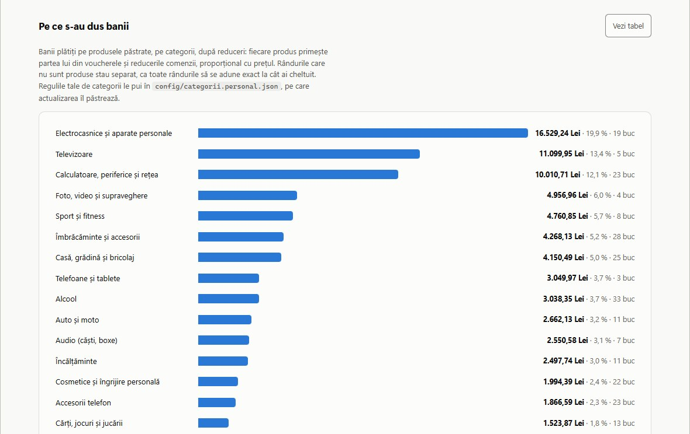
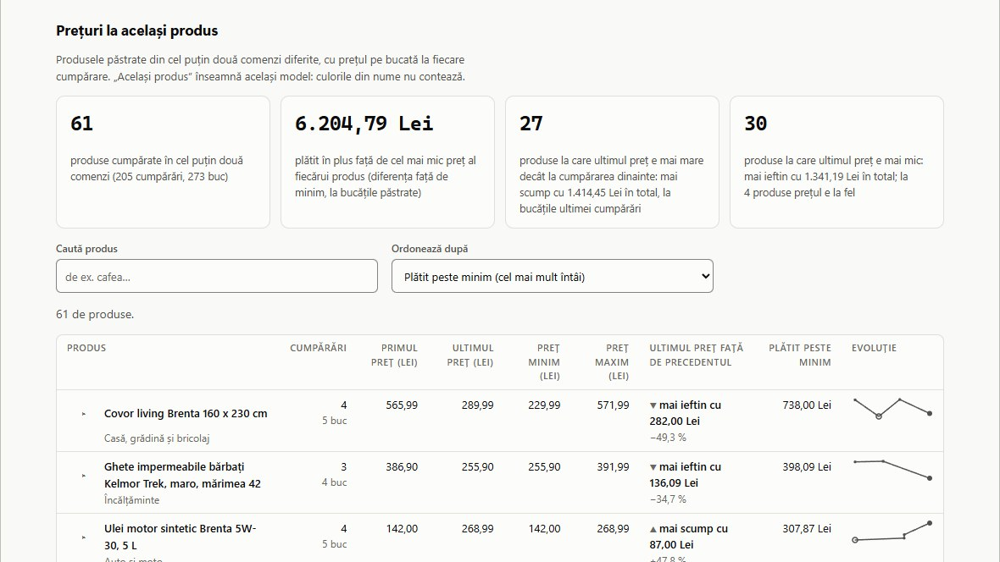
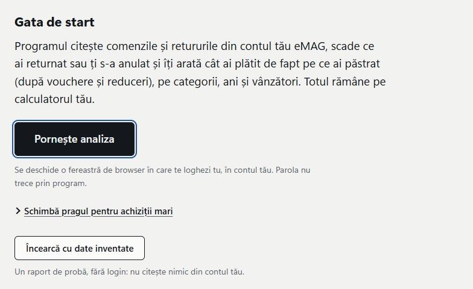

# Cheltuieli eMAG

**Cât ai cheltuit, de fapt, pe eMAG.** Programul citește comenzile și retururile din contul tău eMAG și îți arată cât ai plătit pe ce ai păstrat: pe categorii, pe ani, pe produse. Rulează pe calculatorul tău, pe Windows, macOS și Linux.

<picture>
  <source media="(prefers-color-scheme: dark)" srcset="docs/img/raport-intunecat.jpg">
  
</picture>

Capturile sunt din aplicație, pe comenzile inventate ale demonstrației, nu pe un cont real.

## De ce există

Pe eMAG vezi comenzile una câte una. Nicăieri nu vezi cât ai cheltuit în total, pe ce s-au dus banii sau cât ți-a venit înapoi din retururi. Ca să afli, ar trebui să deschizi fiecare comandă și să aduni de mână, scăzând anulările, retururile și voucherele.

Programul face exact socoteala asta, pentru toate comenzile din cont, în câteva minute.

## Ce îți arată

- **Cât ai plătit efectiv**: „Total plătit” al fiecărei comenzi livrate (după vouchere și reduceri, cu transportul), minus banii primiți înapoi la retururi.
- **Pe ce s-au dus banii**: pe categorii, pe ani, pe vânzători, plus produsele cu cea mai mare valoare păstrată.
- **Cum s-a schimbat prețul** la produsele cumpărate de mai multe ori.
- **Ce n-a intrat în calcul și de ce**: anulări, retururi, comenzi încă pe drum, fiecare cu link spre comanda de pe eMAG.

<picture>
  <source media="(prefers-color-scheme: dark)" srcset="docs/img/categorii-intunecat.jpg">
  
</picture>

<picture>
  <source media="(prefers-color-scheme: dark)" srcset="docs/img/preturi-intunecat.jpg">
  
</picture>

## Pornire

1. Descarcă arhiva ultimei versiuni din [Releases](https://github.com/poprobert0412/cheltuieli-emag/releases/latest) și dezarhiveaz-o.
2. Pornește programul: **Windows** `porneste.bat`, **macOS** `porneste.command`, **Linux** `./porneste.sh`. Nu trebuie instalat nimic: la prima pornire își pregătește singur tot ce îi trebuie, în folderul lui (cam un minut, cu internet).
3. În pagina care se deschide, apasă **Pornește analiza** și loghează-te în eMAG, în fereastra de browser a programului.

Vrei întâi să vezi cum arată? Apasă **Încearcă cu date inventate**: fără cont și fără login.

<picture>
  <source media="(prefers-color-scheme: dark)" srcset="docs/img/start-intunecat.jpg">
  
</picture>

Pași pe fiecare sistem, avertismentele Windows și macOS la prima pornire și opțiunile din terminal: [docs/INSTALARE.md](docs/INSTALARE.md).

## Cum funcționează

1. Lansatorul pornește aplicația: o pagină în browserul tău, servită doar pe calculatorul tău (`127.0.0.1`).
2. La „Pornește analiza” se deschide o fereastră de browser separată. Te loghezi tu; parola și codul 2FA nu trec prin program.
3. Programul citește aceleași pagini pe care le vezi și tu în cont (lista de comenzi, fiecare comandă, retururile), câte trei odată.
4. Calculează totul local și îți arată raportul. Fișierele rămân în `iesiri/`: raportul HTML, CSV-uri pentru Excel și un rezumat în text.

Fiecare cifră, explicată: [docs/CALCUL.md](docs/CALCUL.md).

## Confidențialitate

- Datele tale rămân pe calculatorul tău. Nu există server al autorului, cont sau telemetrie.
- Programul cere pagini doar de pe `www.emag.ro`. Singura altă cerere: la pornirea aplicației întreabă GitHub dacă există o versiune nouă, fără nicio informație despre tine (o oprești cu `EMAG_UPDATE_CHECK=0`).
- Sesiunea eMAG se păstrează local, în `.profil_browser/`, ca să nu te loghezi la fiecare rulare. O ștergi oricând, cu `sterge_sesiunea.bat` sau `--sterge-sesiunea`.

Ce lasă pe disc, ce verifică testele automate și cum raportezi o problemă de securitate: [SECURITY.md](SECURITY.md).

## Actualizări

Când apare o versiune nouă, aplicația îți spune și o instalezi cu **Actualizează acum** (sau din terminal, cu `--actualizeaza`; confirmi cu `DA`). Nimic nu se instalează fără să apeși tu.

- Arhiva e verificată cu amprenta ei SHA-256 înainte de instalare.
- Rămân rapoartele (`iesiri/`), jurnalele (`logs/`), sesiunea (`.profil_browser/`) și uneltele descărcate (`.uv/`, `.venv/`). La categorii contează unde ai scris: regulile din `config/categorii.personal.json` rămân; modificările făcute direct în `config/categorii.json` se pierd la actualizare.
- Dacă instalarea se oprește la jumătate, la pornirea următoare programul revine singur la versiunea veche, înaintea pregătirii lansatorului și a restului programului, apoi face ce i-ai cerut.

Detalii: [docs/INSTALARE.md](docs/INSTALARE.md#actualizare).

## Limitări

- **Neafiliat cu eMAG.** Accesul automat la cont poate fi contrar termenilor eMAG: îl folosești pe răspunderea ta, doar pe contul tău.
- **Testat cap-coadă pe un singur cont real, pe Windows.** Dacă eMAG își schimbă paginile, programul poate da erori sau cifre greșite: compară totalul cu „Comenzile mele” de pe eMAG.
- **Doar `emag.ro`**: `emag.bg` și `emag.hu` nu sunt acoperite.
- **Nu înlocuiește extrasul bancar**: sumele vin din paginile comenzilor, nu din bancă.

## Documentație

- [Instalare și folosire](docs/INSTALARE.md): pornirea pe fiecare sistem, opțiunile, actualizarea, dezinstalarea, probleme frecvente.
- [Cum se calculează](docs/CALCUL.md): definiția fiecărei cifre din raport.
- [Întrebări frecvente](docs/INTREBARI.md): login, permisiuni, cifre diferite de eMAG, categorii.
- [Securitate](SECURITY.md): ce face programul în rețea și pe disc, ce garantează testele.
- [Contribuții](CONTRIBUTING.md): cum rulezi testele și cum trimiți o modificare.
- [Ce e nou](CHANGELOG.md) și [deciziile deja luate](docs/DECIZII.md).

## Licență

[GPL-3.0](LICENSE). Copyright © 2026 Robert Pop. „eMAG” este marca proprietarilor ei și apare aici doar ca să spună ce site citește programul; proiectul nu este creat, aprobat sau sponsorizat de eMAG.
